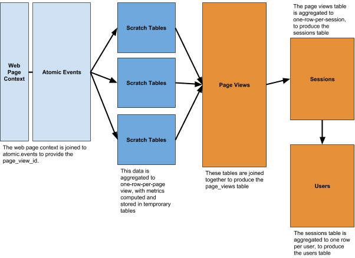

# Web data model

##  Table of contents

- [1. Introduction](#1-introduction)
  - [1.1 Model structure](#11-model-structure)
- [2. Requirements](#2-requirements)
  - [2.1 Recommended requirements](#21-recommended-requirements)
  - [2.2 Minimum requirements](#22-minimum-requirements)
- [3. Understanding the individual fields](#3-understanding-the-individual-fields)
  - [3.1 Page Views table](#31-page-views-table)
     - [3.1.1 User fields](#311-user-fields)
     - [3.1.2 Session fields](#312-session-fields)
     - [3.1.3 Page view fields](#313-page-view-fields)
     - [3.1.4 Time fields](#314-time-fields)
        - [3.1.4.1 Core time fields](#3141-core-time-fields)
        - [3.1.4.2 Optional time fields](#3142-optional-time-fields)
     - [3.1.5 Engagement fields](#315-engagement-fields)
     - [3.1.6 Page fields](#316-page-fields)
     - [3.1.7 Referer fields](#317-referer-fields)
     - [3.1.8 Marketing fields](#318-marketing-fields)
     - [3.1.9 Geo fields](#319-geo-fields)
     - [3.1.10 IP address fields](#3110-ip-address-fields)
     - [3.1.11 Browser fields](#3111-browser-fields)
     - [3.1.12 OS fields](#3112-os-fields)
     - [3.1.13 Device fields](#3113-device-fields)
     - [3.1.14 Performance timing fields](#3114-performance-timing-fields)
     - [3.1.15 Other fields](#3115-other-fields)
  - [3.2 Sessions table](#32-sessions-table)
     - [3.2.1 User fields](#321-user-fields)
     - [3.2.2 Session fields](#322-session-fields)
     - [3.2.3 Time fields](#323-time-fields)
        - [3.2.3.1 Core time fields](#3231-core-time-fields)
        - [3.2.3.2 Optional time fields](#3232-optional-time-fields)
     - [3.2.4 Engagement fields](#324-engagement-fields)
     - [3.2.5 First page fields](#325-first-page-fields)
     - [3.2.6 Referer fields](#326-referer-fields)
     - [3.2.7 Marketing fields](#327-marketing-fields)
     - [3.2.8 Geo fields](#328-geo-fields)
     - [3.2.9 IP address fields](#329-ip-address-fields)
     - [3.2.10 Browser fields](#3210-browser-fields)
     - [3.2.11 OS fields](#3211-os-fields)
     - [3.2.12 Device fields](#3212-device-fields)
     - [3.2.13 Other fields](#3213-other-fields)
  - [3.3 Users table](#33-users-table)
     - [3.3.1 User fields](#331-user-fields)
     - [3.3.2 Time fields](#332-time-fields)
        - [3.3.2.1 Core time fields](#3321-core-time-fields)
        - [3.3.2.2 Optional time fields](#3322-optional-time-fields)
     - [3.3.3 Engagement fields](#333-engagement-fields)
     - [3.3.4 First page fields](#334-first-page-fields)
     - [3.3.5 Referer fields](#335-referer-fields)
     - [3.3.6 Marketing fields](#336-marketing-fields)
     - [3.3.7 Other fields](#337-other-fields)

## 1. Introduction

The most common tracker for Snowplow users to get started with is the [JavaScript Tracker](https://github.com/snowplow/snowplow-javascript-tracker). Like all our trackers, you can use it to track the self-describing events and entities that you define yourself. In addition, Snowplow provides built-in support for the web-native events that most users will want to track. This includes events such as page views, page pings, and link clicks.

The Snowplow SQL data model makes it easier to get started with web data. It aggregates the page view and page ping events to create a set of derived tables that contain a lot of detail, including: time engaged, scroll depth, and page performance. The model comes in three variants:

1. A straightforward set of [SQL queries](./redshift/)
Use this version to model your web events data in Amazon Redshift.
2. A variant optimized for [SQL Runner](./sql-runner/)
SQL Runner is an [open source app](https://github.com/snowplow/sql-runner) that makes it easy to execute SQL statements programmatically as part of a Snowplow data pipeline. This version of the model includes all the SQL queries that make up the model, as well as a playbook you can use to update the tables whenever there's new data.
3. A variant optimized for [Looker](./looker)
Looker is a modern [BI tool](https://looker.com/) that can be used to model and explore Snowplow data. Use this version to quickly set up a Looker Block with the Snowplow web data model.

## 1.1 Model structure

The web model aggregates Snowplow atomic data to to a page view level, then aggregates that data to a session and user level, to produce three derived tables (page_views, sessions, users):




## 2. Requirements

To use this model you must have already set up Snowplow data tracking on your website (using the JavaScript tracker v2.6.0+), to track standard page views, with activity tracking enabled to set to send page pings - the model presumes 10 second intervals between page pings, so if your setup is different you will need to amend the [events-time step](https://github.com/snowplow/web-data-model/blob/master/sql-runner/sql/web-model/01-page-views/02-events-time.sql). You will also need to have enabled the web page context.

To amend the SQL to match your page ping settings, replace the first two `10`s in [line 34 of the events-time step](https://github.com/snowplow/web-data-model/blob/master/sql-runner/sql/web-model/01-page-views/02-events-time.sql#L34) with the `heartBeat` setting of your JavaScript tracker, and the last one with the `minimumVisitLength` setting.

For example, if my page ping settings are `snowplow_name_here('enableActivityTracking', 30, 20);`, this line becomes:

```
20 * COUNT(DISTINCT(FLOOR(EXTRACT(EPOCH FROM ev.derived_tstamp)/20))) - 30 AS time_engaged_in_s
```

In the sql-runner variant of the model, this can be achieved by setting the [playbook](sql-runner/playbook/web-model.yml.tmpl) variables:

`first_ping` should reflect the `minimumVisitLength` argument (30 in our example above)

`heartbeat` should reflect the `heartBeat` argument (20 in our example above).

Find more information on how to set up Snowplow tracking via the [JavaScript tracker](https://github.com/snowplow/snowplow/wiki/javascript-tracker).

Find more information on the [web page context](https://github.com/snowplow/snowplow/wiki/1-General-parameters-for-the-Javascript-tracker-v2.6#webPage).

Find more information on [activity tracking/page pings](https://github.com/snowplow/snowplow/wiki/2-Specific-event-tracking-with-the-Javascript-tracker#32-track-engagement-with-a-web-page-over-time-page-pings)


### 2.1 Recommended requirements

To be able to run the model 'as is' and take full advantage of all options, you will need to be using version 2.6.0+ of the Snowplow JavaScript tracker and Snowplow 71+. The web page context must be enabled. You should also enable the [performance timing context](https://github.com/snowplow/snowplow/wiki/1-General-parameters-for-the-Javascript-tracker-v2.6#performanceTiming), and the [ua parser](https://github.com/snowplow/snowplow/wiki/ua-parser-enrichment), [campaign attribution](https://github.com/snowplow/snowplow/wiki/Campaign-attribution-enrichment), [IP lookups](https://github.com/snowplow/snowplow/wiki/IP-lookups-enrichment) and [referer parser](https://github.com/snowplow/snowplow/wiki/referer-parser-enrichment) enrichments.


### 2.2 Minimum requirements

You must be using version 2.5.0+ of the JavaScript tracker for the web page context to work. This context is required and you will not be able to use the model without it.

The performance timing context, and the referer parser, ua parser and campaign attribution enrichments are optional. You will still be able to use the model without them but you will have to comment out the relevant parts from the SQL code. 

The [user agent utils enrichment](https://github.com/snowplow/snowplow/wiki/user-agent-utils-enrichment) has been depracated but if you have enabled it manually, you can include an additional filter (currently commented out) on the `br_family` field which is populated by this enrichment. 

By default, the model uses the more accurate `derived_tstamp` which makes allowance for inaccurate device clocks. This timestamp is only available in version 2.6.0+ of the JavaScript tracker and Snowplow 71+. If you are using older versions, you will need to change the relevant timestamps in the SQL files.


## 3. Understanding the individual fields

In order to analyse Snowplow data, it is important to understand how it is structured.


### 3.1 Page Views table


#### 3.1.1 User fields

| Field                          | Type | Description                                    | Example                                |
| :---                           | :--- | :---                                           | :---                                   |
| `user_custom_id`               | text | Unique ID set by business, `user_id` atomic field | 'jon.doe@email.com'                    |
| `user_snowplow_domain_id`      | text | User ID set by Snowplow using 1st party cookie | 'bc2e92ec6c204a14'                     |
| `user_snowplow_crossdomain_id` | text | User ID set by Snowplow using 3rd party cookie | 'ecdff4d0-9175-40ac-a8bb-325c49733607' |


#### 3.1.2 Session fields

| Field           | Type | Description                  | Example                               |
| :---            | :--- | :---                         | :---                                  |
| `session_id`    | text | A visit / session identifier | 'c6ef3124-b53a-4b13-a233-0088f79dcbcb'|
| `session_index` | int  | A visit / session index      | 3                                     |

`session_index` is the number of the current user session. For example, an event occurring during a user's first session would have `session_index` set to 1.


#### 3.1.3 Page view fields

| Field                        | Type | Description                               | Example                                |
| :---                         | :--- | :---                                      | :---                                   |
| `page_view_id`               | text | UUID                                      | 'e7c41b46-f449-49a0-a8ef-9a4037944004' |
| `page_view_index`            | int  | A page view index                         | 3                                      |
| `page_view_in_session_index` | int  | A page view index within a single session | 1                                      |

`page_view_index` is the number of the current page view. For example, if this is the second page viewed by the user, `page_view_index` will be set to 2.

`page_view_in_session_index` is the number of the current page view within the current session. Consider the example of a user who views two pages on their first visit and three more on their second visit. The second page view of the second visit will be their fourth overall. Hence `page_view_index` will be set to 4 but `page_view_in_session_index` will be set to 2.


#### 3.1.4 Time fields


##### 3.1.4.1 Core time fields

| Field                   | Type      | Description                                                      | Example                      |
| :---                    | :---      | :---                                                             | :---                         |
| `page_view_start`       | timestamp | Timestamp for the start of the page view on your preferred clock | '2015-11-17 04:13:53.000000' |
| `page_view_end`         | timestamp | Timestamp for the end of the page view on your preferred clock   | '2015-11-17 04:16:03.997000' |
| `page_view_start_local` | timestamp | Timestamp for the start of the page view on the user's clock     | '2015-11-17 15:13:53.000000' |
| `page_view_end_local`   | timestamp | Timestamp for the end of the page view on the user's clock       | '2015-11-17 15:16:03.000000' |

The timestamps are calculated by default from the `derived_tstamp`. Change this in the SQL code if you want to use a different timestamp.

The time zone for `page_view_start` and `page_view_end` is set in the SQL code. The time zone for `page_view_start_local` and `page_view_end_local` is derived from the time zone of the OS.


##### 3.1.4.2 Optional time fields

As well as the core timestamp fields, you can also have a variety of derived time fields. Some examples are already included in the code for this model. They are:

| Field                               | Type | Description                                                            | Example               |
| :---                                | :--- | :---                                                                   | :---                  |
| `page_view_time`                    | text | Time derived from `page_view_start`                                    | '2015-11-17 04:13:53' |
| `page_view_minute`                  | text | Time derived from `page_view_start`, truncated to the minute           | '2015-11-17 04:13'    |
| `page_view_hour`                    | text | Time derived from `page_view_start`, truncated to the hour             | '2015-11-17 04'       |
| `page_view_date`                    | text | Date derived from `page_view_start`                                    | '2015-11-17'          |
| `page_view_week`                    | text | Year, month and week number derived from `page_view_start`             | '2015-11-16'          |
| `page_view_month`                   | text | Year and month derived from `page_view_start`                          | '2015-11'             |
| `page_view_quarter`                 | text | Quarter derived from `page_view_start`                                 | '2015-10'             |
| `page_view_year`                    | int  | Year derived from `page_view_start`                                    | 2015                  |
| `page_view_local_time`              | text | Time derived from `page_view_start_local`                              | '2015-11-17 15:13:53' |
| `page_view_local_time_of_day`       | text | Hour and minute derived from `page_view_start_local`                   | '15:13'               |
| `page_view_local_hour_of_day`       | int  | Hour derived from `page_view_start_local`                              | 15                    |
| `page_view_local_day_of_week`       | text | Day of week derived from `page_view_start_local`, on a scale of 1 to 7 | '4'                   |
| `page_view_local_day_of_week_index` | int  | Day of week derived from `page_view_start_local`, on a scale of 0 to 6 | 0                     |

`page_view_quarter` indicates the quarter by the starting month, so '2015-10' is the 'October quarter', or 'Q4'.


#### 3.1.5 Engagement fields

| Field                               | Type    | Description                                       | Example       |
| :---                                | :---    | :---                                              | :---          |
| `time_engaged_in_s`                 | int     | Time spent by the user on the page                | 70            |
| `time_engaged_in_s_tier`            | text    | Range of time spent by the user on the page       | '60s or more' |
| `horizontal_pixels_scrolled`        | int     | Distance the user scrolled horizontally in pixels | 0             |
| `vertical_pixels_scrolled`          | int     | Distance the user scrolled vertically in pixels   | 1948          |
| `horizontal_percentage_scrolled`    | int     | Percentage of page scrolled horizontally          | 100           |
| `vertical_percentage_scrolled`      | int     | Percentage of page scrolled vertically            | 52            |
| `vertical_percentage_scrolled_tier` | text    | Range of percentage of page scrolled vertically   | '50% to 74%'  |
| `user_bounced`                      | boolean | Did the user bounce?                              | FALSE         |
| `user_engaged`                      | boolean | Did the user engage with the page?                | TRUE          |

`time_engaged_in_s` assumes `page_ping`s have been set to fire every 10 seconds. Change the setting in the SQL code to match your own settings.

`user_bounced` and `user_engaged` are derived from `time_engaged_in_s` and `vertical_percentage_scrolled`. Users who engage with the page for 0 seconds are counted as 'bounced'. Users who engage with the page for 30 seconds or more and scroll to see at least 25% of the content on the page are counted as 'engaged'.


#### 3.1.6 Page fields

| Field               | Type | Description                  | Example                                                                         |
| :---                | :--- | :---                         | :---                                                                            |
| `page_url`          | text | The page URL	                | 'http://www.example.com'                                                        |
| `page_url_scheme`   | text | Scheme aka protocol          | 'https'                                                                         |
| `page_url_host`     | text | Host aka domain              | 'snowplowanalytics.com'                                                         |
| `page_url_port`     | int  | Port if specified, 80 if not | 80                                                                              |
| `page_url_path`     | text | Path to page                 | '/product/index.html'                                                           |
| `page_url_query`    | text | Querystring                  | 'id=GTM-DLRG'                                                                   |
| `page_url_fragment` | text | Fragment aka anchor          | '4-conclusion'                                                                  |
| `page_title`        | text | Web page title               | 'Using ChartIO to visualize and interrogate Snowplow data - Snowplow Analytics' |
| `page_width`        | int  | The page's width in pixels   | 1024                                                                            |
| `page_height`       | int  | The page's height in pixels  | 3000                                                                            |


#### 3.1.7 Referer fields

| Field                  | Type | Description                           | Example                  |
| :---                   | :--- | :---                                  | :---                     |
| `referer_url`          | text | The referer URL                       | 'www.google.de/'         |
| `referer_url_scheme`   | text | Referer scheme                        | 'http'                   |
| `referer_url_host`     | text | Referer host                          | 'www.bing.com'           |
| `referer_url_port`     | int  | Referer port	                        | 80                       |
| `referer_url_path`     | text | Referer page path                     | '/images/search'         |
| `referer_url_query`    | text | Referer URL querystring               | 'q=psychic+oracle+cards' |
| `referer_url_fragment` | text | Referer URL fragment                  | 'process-that-data'      |
| `referer_medium`       | text | Type of referer                       | 'search', 'internal'     |
| `referer_source`       | text | Name of referer if recognised         | 'Bing images'            |
| `referer_term`         | text | Keywords if source is a search engine | 'psychic oracle cards'   |

These fields require the the referer parser enrichment. Find more information about it [here](https://github.com/snowplow/snowplow/wiki/referer-parser-enrichment)

#### 3.1.8 Marketing fields

| Field                | Type | Description                                                    | Example                                 |
| :---                 | :--- | :---                                                           | :---                                    |
| `marketing_medium`   | text | Type of traffic source                                         | 'cpc', 'affiliate', 'organic', 'social' |
| `marketing_source`   | text | The company / website where the traffic came from              | 'Google', 'Facebook'                    |
| `marketing_term`     | text | Any keywords associated with the referer                       | 'new age tarot decks'                   |
| `marketing_content`  | text | The content of the ad. (Or an ID so that it can be looked up.) | '13894723'                              |
| `marketing_campaign` | text | The campaign ID                                                | 'diageo-123'                            |
| `marketing_click_id` | text | The click ID                                                   | 'ac3d8e459'                             |
| `marketing_network`  | text | The ad network to which the click ID belongs                   | 'DoubleClick'                           |

These fields require the campaign attribution enrichment. Find more information about it [here](https://github.com/snowplow/snowplow/wiki/Campaign-attribution-enrichment).


#### 3.1.9 Geo fields

| Field             | Type | Description                                               | Example              |
| :---              | :--- | :---                                                      | :---                 |
| `geo_country`     | text | ISO 3166-1 code for the country the visitor is located in | 'GB', 'US'           |
| `geo_region`      | text | ISO-3166-2 code for country region the visitor is in      | 'I9', 'TX'           |
| `geo_region_name` | text | Visitor region name                                       | 'Florida'            |
| `geo_city`        | text | City the visitor is in                                    | 'New York', 'London' |
| `geo_zipcode`     | text | Postcode the visitor is in                                | '94109'              |
| `geo_latitude`    | text | Visitor location latitude                                 | '37.443604'          |
| `geo_longitude`   | text | Visitor location longitude                                | '-122.4124'          |
| `geo_timezone`    | text | Visitor timezone name                                     | 'Europe/London'      |

These fields require the IP lookups enrichment. Find more information about it [here](https://github.com/snowplow/snowplow/wiki/IP-lookups-enrichment).

#### 3.1.10 IP address fields

| Field             | Type | Description                                                                                   | Example              |
| :---              | :--- | :---                                                                                          | :---                 |
| `ip_address`      | text | The IP address of the visitor                                                                 | '125.22.43.11'       |
| `ip_isp`          | text | Visitor's ISP                                                                                 | 'FDN Communications' |
| `ip_organization` | text | Organization associated with the visitor's IP address - defaults to ISP name if none is found | 'Bouygues Telecom'   |
| `ip_domain`       | text | Second level domain name associated with the visitor's IP address                             | 'nuvox.net'          |
| `ip_net_speed`    | text | Visitor's connection type                                                                     | 'Cable/DSL'          |

These fields require the IP lookups enrichment. Find more information about it [here](https://github.com/snowplow/snowplow/wiki/IP-lookups-enrichment).

#### 3.1.11 Browser fields

| Field                   | Type | Description                                   | Example            |
| :---                    | :--- | :---                                          | :---               |
| `browser`               | text | The name and version of the visitor's browser | 'Chrome 49.0.2623' |
| `browser_name`          | text | The name, or family, of the visitor's browser | 'Chrome'           |
| `browser_major_version` | int  | Browser major version                         | 49                 |
| `browser_minor_version` | int  | Browser minor version                         | 0                  |
| `browser_build_version` | int  | Browser build version                         | 2623               |
| `browser_engine`        | text | Browser rendering engine                      | 'WEBKIT'           |
| `browser_window_width`  | int  | Viewport width                                | 1433               |
| `browser_window_height` | int  | Viewport height                               | 567                |
| `browser_language`      | text | Language the browser is set to                | 'en-GB'            |

`browser`, `browser_name`, `browser_major_version`, `browser_minor_version` and  `browser_build_version` require the ua parser enrichment. Find more information about it [here](https://github.com/snowplow/snowplow/wiki/ua-parser-enrichment).


#### 3.1.12 OS fields

| Field              | Type | Description                              | Example            |
| :---               | :--- | :---                                     | :---               |
| `os`               | text | The name and version of the visitor's OS | 'Mac OS X 10.10.1' |
| `os_name`          | text | The name of the visitor's OS             | 'Mac OS X'         |
| `os_major_version` | int  | OS major version                         | 10                 |
| `os_minor_version` | int  | OS minor version                         | 10                 |
| `os_build_version` | int  | OS build version                         | 1                  |
| `os_manufacturer`  | text | OS manufacturer                          | 'Apple Inc.'       |
| `os_timezone`      | text | Time zone the OS is set to               | 'America/Chicago'  |

All OS fields except `os_timezone` and `os_manufacturer` require the ua parser enrichment. Find more information about it [here](https://github.com/snowplow/snowplow/wiki/ua-parser-enrichment).


#### 3.1.13 Device fields

| Field              | Type    | Description           | Example    |
| :---               | :---    | :---                  | :---       |
| `device`           | text    | Device model          | 'XT1022'   |
| `device_type`      | text    | Type of device        | 'Computer' |
| `device_is_mobile` | boolean | Is the device mobile? | TRUE       |

`device` requires the ua parser enrichment. Find more information about it [here](https://github.com/snowplow/snowplow/wiki/ua-parser-enrichment).


#### 3.1.14 Performance timing fields

| Field                                    | Type | Description                                                                                | Example |
| :---                                     | :--- | :---                                                                                       | :---    |
| `redirect_time_in_ms`                    | int  | Time to redirect the visitor                                                               | 6864    |
| `unload_time_in_ms`                      | int  | Time to complete the unload event                                                          | 1       |
| `app_cache_time_in_ms`                   | int  | Time to fetch resource from relevant application cache                                     | 3       |
| `dns_time_in_ms`                         | int  | Time to complete domain lookup                                                             | 1       |
| `tcp_time_in_ms`                         | int  | Time to establish connection                                                               | 380     |
| `request_time_in_ms`                     | int  | Time between the user agent sending a request and receiving the first byte of the response | 747     |
| `response_time_in_ms`                    | int  | Time to complete the response                                                              | 633     |
| `processing_time_in_ms`                  | int  | Processing time                                                                            | 10849   |
| `dom_loading_to_interactive_time_in_ms`  | int  | Time for the current document readiness to change from 'loading' to 'interactive'          | 3996    |
| `dom_interactive_to_complete_time_in_ms` | int  | Time for the current document readiness to change from 'interactive' to 'complete'         | 6853    |
| `onload_time_in_ms`                      | int  | Time to complete the load event                                                            | 8       |
| `total_time_in_ms`                       | int  | Total time from navigation start to load event completion                                  | 18470   |

These fields require the `performanceTiming` context. Find more information about it [here](https://github.com/snowplow/snowplow/wiki/1-General-parameters-for-the-Javascript-tracker-v2.6#performanceTiming).

All times are measured in milliseconds.


#### 3.1.15 Other fields

| Field    | Type | Description    | Example       |
| :---     | :--- | :---           | :---          |
| `app_id` | text | Application ID | 'snowplowweb' |

The application ID is used to distinguish different applications that are being tracked by the same Snowplow stack, eg 'production' versus 'dev'. This is hardcooded in the tracker's `appId` argument.


### 3.2 Sessions table


#### 3.2.1 User fields

| Field                          | Type | Description                                    | Example                                |
| :---                           | :--- | :---                                           | :---                                   |
| `user_custom_id`               | text | Unique ID set by business, `user_id`           | 'jon.doe@email.com'                    |
| `user_snowplow_domain_id`      | text | User ID set by Snowplow using 1st party cookie | 'bc2e92ec6c204a14'                     |
| `user_snowplow_crossdomain_id` | text | User ID set by Snowplow using 3rd party cookie | 'ecdff4d0-9175-40ac-a8bb-325c49733607' |


#### 3.2.2 Session fields

| Field           | Type | Description                  | Example                               |
| :---            | :--- | :---                         | :---                                  |
| `session_id`    | text | A visit / session identifier | 'c6ef3124-b53a-4b13-a233-0088f79dcbcb'|
| `session_index` | int  | A visit / session index      | 3                                     |

`session_index` is the number of the current user session. For example, an event occurring during a user's first session would have `session_index` set to 1.


#### 3.2.3 Time fields


##### 3.2.3.1 Core time fields

| Field                 | Type      | Description                                                    | Example                      |
| :---                  | :---      | :---                                                           | :---                         |
| `session_start`       | timestamp | Timestamp for the start of the session on your preferred clock | '2015-07-20 10:35:22.441000' |
| `session_end`         | timestamp | Timestamp for the end of the session on your preferred clock   | '2015-07-20 12:38:17.238000' |
| `session_start_local` | timestamp | Timestamp for the start of the session on the user's clock     | '2015-07-20 15:05:22.441000' |
| `session_end_local`   | timestamp | Timestamp for the end of the session on the user's clock       | '2015-07-20 17:08:17.238000' |

`session_start` corresponds to the first value of `page_view_start` within that session; and `session_end` corresponds to the last `page_view_end` within that session.

The timestamps are calculated by default from the `derived_tstamp`. Change this in the SQL code if you want to use a different timestamp.

The time zone for `session_start` and `session_end` is set in the SQL code when defining the `page_view_start` and `page_view_end` fields. The time zone for `session_start_local` and `session_end_local` is derived from the time zone of the OS (by way of `page_view_start_local` and `page_view_end_local`).


##### 3.2.3.2 Optional time fields

As well as the core timestamp fields, you can also have a variety of derived time fields. Some examples are already included in the code for this model. They are:

| Field                             | Type | Description                                                          | Example               |
| :---                              | :--- | :---                                                                 | :---                  |
| `session_time`                    | text | Time derived from `session_start`                                    | '2015-09-03 22:22:02' |
| `session_minute`                  | text | Time derived from `session_start`, truncated to the minute           | '2015-09-03 22:22'    |
| `session_hour`                    | text | Time derived from `session_start`, truncated to the hour             | '2015-09-03 22'       |
| `session_date`                    | text | Date derived from `session_start`                                    | '2015-09-03'          |
| `session_week`                    | text | Year, month and week number derived from `session_start`             | '2015-08-31'          |
| `session_month`                   | text | Year and month derived from `session_start`                          | '2015-09'             |
| `session_quarter`                 | text | Quarter derived from `session_start`                                 | '2015-07'             |
| `session_year`                    | int  | Year derived from `session_start`                                    | 2015                  |
| `session_local_time`              | text | Time derived from `session_start_local`                              | '2015-11-17 15:13:53' |
| `session_local_time_of_day`       | text | Hour and minute derived from `session_start_local`                   | '15:13'               |
| `session_local_hour_of_day`       | int  | Hour derived from `session_start_local`                              | 15                    |
| `session_local_day_of_week`       | text | Day of week derived from `session_start_local`, on a scale of 1 to 7 | '4'                   |
| `session_local_day_of_week_index` | int  | Day of week derived from `session_start_local`, on a scale of 0 to 6 | 0                     |

`session_quarter` indicates the quarter by the starting month, so '2015-07' is the 'July quarter', or 'Q3'.


#### 3.2.4 Engagement fields

| Field                    | Type    | Description                                                        | Example        |
| :---                     | :---    | :---                                                               | :---           |
| `page_views`             | int     | Number of page views within this session                           | 8              |
| `bounced_page_views`     | int     | Number of page views within this session where the visitor bounced | 0              |
| `engaged_page_views`     | int     | Number of page views within this session where the visitor engaged | 1              |
| `time_engaged_in_s`      | int     | Time spent by the user on this visit                               | 320            |
| `time_engaged_in_s_tier` | text    | Range of time spent by the user on this visit                      | '240s or more' |
| `user_bounced`           | boolean | Did the user bounce on their first page view in this session?      | FALSE          |
| `user_engaged`           | boolean | Did the user engage with the website in this session?              | TRUE           |

`time_engaged_in_s` assumes `page_ping`s have been set to fire every 10 seconds. Change the setting in the SQL code to match your own settings.

`user_bounced` and `user_engaged` are derived from `page_views` and `time_engaged_in_s`. Users who only viewed 1 page and bounced on that page view, are counted as 'bounced'. Users who viewed more than 2 pages and spent at least 60 seconds in the same session are counted as 'engaged'.


#### 3.2.5 First page fields

| Field                     | Type | Description                  | Example                                                                         |
| :---                      | :--- | :---                         | :---                                                                            |
| `first_page_url`          | text | The page URL	                | 'http://www.example.com'                                                        |
| `first_page_url_scheme`   | text | Scheme aka protocol          | 'https'                                                                         |
| `first_page_url_host`     | text | Host aka domain              | 'snowplowanalytics.com'                                                         |
| `first_page_url_port`     | int  | Port if specified, 80 if not | 80                                                                              |
| `first_page_url_path`     | text | Path to page                 | '/product/index.html'                                                           |
| `first_page_url_query`    | text | Querystring                  | 'id=GTM-DLRG'                                                                   |
| `first_page_url_fragment` | text | Fragment aka anchor          | '4-conclusion'                                                                  |
| `first_page_title`        | text | Web page title               | 'Using ChartIO to visualize and interrogate Snowplow data - Snowplow Analytics' |

These fields are derived from the page fields of the Page Views table to represent the first page view within the session.


#### 3.2.6 Referer fields

| Field                  | Type | Description                           | Example                  |
| :---                   | :--- | :---                                  | :---                     |
| `referer_url`          | text | The referer URL                       | 'www.google.de/'         |
| `referer_url_scheme`   | text | Referer scheme                        | 'http'                   |
| `referer_url_host`     | text | Referer host                          | 'www.bing.com'           |
| `referer_url_port`     | int  | Referer port	                        | 80                       |
| `referer_url_path`     | text | Referer page path                     | '/images/search'         |
| `referer_url_query`    | text | Referer URL querystring               | 'q=psychic+oracle+cards' |
| `referer_url_fragment` | text | Referer URL fragment                  | 'process-that-data'      |
| `referer_medium`       | text | Type of referer                       | 'search', 'internal'     |
| `referer_source`       | text | Name of referer if recognised         | 'Bing images'            |
| `referer_term`         | text | Keywords if source is a search engine | 'psychic oracle cards'   |

These fields carry information about the first page view within the session.


#### 3.2.7 Marketing fields

| Field                | Type | Description                                                    | Example                                 |
| :---                 | :--- | :---                                                           | :---                                    |
| `marketing_medium`   | text | Type of traffic source                                         | 'cpc', 'affiliate', 'organic', 'social' |
| `marketing_source`   | text | The company / website where the traffic came from              | 'Google', 'Facebook'                    |
| `marketing_term`     | text | Any keywords associated with the referer                       | 'new age tarot decks'                   |
| `marketing_content`  | text | The content of the ad. (Or an ID so that it can be looked up.) | '13894723'                              |
| `marketing_campaign` | text | The campaign ID                                                | 'diageo-123'                            |
| `marketing_click_id` | text | The click ID                                                   | 'ac3d8e459'                             |
| `marketing_network`  | text | The ad network to which the click ID belongs                   | 'DoubleClick'                           |

These fields carry information about the first page view within the session.

These fields require the campaign attribution enrichment. Find more information about it [here](https://github.com/snowplow/snowplow/wiki/Campaign-attribution-enrichment).


#### 3.2.8 Geo fields

| Field             | Type | Description                                               | Example              |
| :---              | :--- | :---                                                      | :---                 |
| `geo_country`     | text | ISO 3166-1 code for the country the visitor is located in | 'GB', 'US'           |
| `geo_region`      | text | ISO-3166-2 code for country region the visitor is in      | 'I9', 'TX'           |
| `geo_region_name` | text | Visitor region name                                       | 'Florida'            |
| `geo_city`        | text | City the visitor is in                                    | 'New York', 'London' |
| `geo_zipcode`     | text | Postcode the visitor is in                                | '94109'              |
| `geo_latitude`    | text | Visitor location latitude                                 | '37.443604'          |
| `geo_longitude`   | text | Visitor location longitude                                | '-122.4124'          |
| `geo_timezone`    | text | Visitor timezone name                                     | 'Europe/London'      |

These fields require the IP lookups enrichment. Find more information about it [here](https://github.com/snowplow/snowplow/wiki/IP-lookups-enrichment).


#### 3.2.9 IP address fields

| Field             | Type | Description                                                                                   | Example              |
| :---              | :--- | :---                                                                                          | :---                 |
| `ip_address`      | text | The IP address of the visitor                                                                 | '125.22.43.11'       |
| `ip_isp`          | text | Visitor's ISP                                                                                 | 'FDN Communications' |
| `ip_organization` | text | Organization associated with the visitor's IP address - defaults to ISP name if none is found | 'Bouygues Telecom'   |
| `ip_domain`       | text | Second level domain name associated with the visitor's IP address                             | 'nuvox.net'          |
| `ip_net_speed`    | text | Visitor's connection type                                                                     | 'Cable/DSL'          |


#### 3.2.10 Browser fields

| Field                   | Type | Description                                   | Example            |
| :---                    | :--- | :---                                          | :---               |
| `browser`               | text | The name and version of the visitor's browser | 'Chrome 49.0.2623' |
| `browser_name`          | text | The name, or family, of the visitor's browser | 'Chrome'           |
| `browser_major_version` | int  | Browser major version                         | 49                 |
| `browser_minor_version` | int  | Browser minor version                         | 0                  |
| `browser_build_version` | int  | Browser build version                         | 2623               |
| `browser_engine`        | text | Browser rendering engine                      | 'WEBKIT'           |
| `browser_language`      | text | Language the browser is set to                | 'en-GB'            |

`browser`, `browser_name`, `browser_major_version`, `browser_minor_version` and  `browser_build_version` require the ua parser enrichment. Find more information about it [here](https://github.com/snowplow/snowplow/wiki/ua-parser-enrichment).


#### 3.2.11 OS fields

| Field              | Type | Description                              | Example            |
| :---               | :--- | :---                                     | :---               |
| `os`               | text | The name and version of the visitor's OS | 'Mac OS X 10.10.1' |
| `os_name`          | text | The name of the visitor's OS             | 'Mac OS X'         |
| `os_major_version` | int  | OS major version                         | 10                 |
| `os_minor_version` | int  | OS minor version                         | 10                 |
| `os_build_version` | int  | OS build version                         | 1                  |
| `os_manufacturer`  | text | OS manufacturer                          | 'Apple Inc.'       |
| `os_timezone`      | text | Time zone the OS is set to               | 'America/Chicago'  |

All OS fields except `os_timezone` and `os_manufacturer` require the ua parser enrichment. Find more information about it [here](https://github.com/snowplow/snowplow/wiki/ua-parser-enrichment).


#### 3.2.12 Device fields

| Field              | Type    | Description           | Example    |
| :---               | :---    | :---                  | :---       |
| `device`           | text    | Device model          | 'XT1022'   |
| `device_type`      | text    | Type of device        | 'Computer' |
| `device_is_mobile` | boolean | Is the device mobile? | TRUE       |

`device` requires the ua parser enrichment. Find more information about it [here](https://github.com/snowplow/snowplow/wiki/ua-parser-enrichment).


#### 3.2.13 Other fields

| Field    | Type | Description    | Example       |
| :---     | :--- | :---           | :---          |
| `app_id` | text | Application ID | 'snowplowweb' |

The application ID is used to distinguish different applications that are being tracked by the same Snowplow stack, eg 'production' versus 'dev'. This is hardcooded in the tracker's `appId` argument.


### 3.3 Users table


#### 3.3.1 User fields

| Field                          | Type | Description                                    | Example                                |
| :---                           | :--- | :---                                           | :---                                   |
| `user_custom_id`               | text | Unique ID set by business                      | 'jon.doe@email.com'                    |
| `user_snowplow_domain_id`      | text | User ID set by Snowplow using 1st party cookie | 'bc2e92ec6c204a14'                     |
| `user_snowplow_crossdomain_id` | text | User ID set by Snowplow using 3rd party cookie | 'ecdff4d0-9175-40ac-a8bb-325c49733607' |


#### 3.3.2 Time fields


##### 3.3.2.1 Core time fields

| Field                 | Type      | Description                                                    | Example                      |
| :---                  | :---      | :---                                                           | :---                         |
| `first_session_start`       | timestamp | Timestamp for the start of the user's first session on your preferred clock | '2015-07-20 10:35:22.441000' |
| `first_session_start_local` | timestamp | Timestamp for the start of the user's first session on the user's clock     | '2015-07-20 15:05:22.441000' |
| `last_session_end`         | timestamp | Timestamp for the end of the user's last session on your preferred clock   | '2015-07-20 12:38:17.238000' |

`first_session_start` corresponds to the first value of `session_start` for this user from the Sessions table; and `last_session_end` corresponds to the last `session_end` for this user from the Sessions table.

The timestamps are calculated by default from the `derived_tstamp`. Change this in the SQL code if you want to use a different timestamp.

The time zone for `first_session_start` and `last_session_end` is set in the SQL code when defining the `page_view_start` and `page_view_end` fields. The time zone for `first_session_start_local` is derived from the time zone of the OS (by way of `page_view_start_local`).


##### 3.3.2.2 Optional time fields

As well as the core timestamp fields, you can also have a variety of derived time fields. Some examples are already included in the code for this model. They are:

| Field                                   | Type | Description                                                                | Example               |
| :---                                    | :--- | :---                                                                       | :---                  |
| `first_session_time`                    | text | Time derived from `first_session_start`                                    | '2015-09-03 22:22:02' |
| `first_session_minute`                  | text | Time derived from `first_session_start`, truncated to the minute           | '2015-09-03 22:22'    |
| `first_session_hour`                    | text | Time derived from `first_session_start`, truncated to the hour             | '2015-09-03 22'       |
| `first_session_date`                    | text | Date derived from `first_session_start`                                    | '2015-09-03'          |
| `first_session_week`                    | text | Year, month and week number derived from `first_session_start`             | '2015-08-31'          |
| `first_session_month`                   | text | Year and month derived from `first_session_start`                          | '2015-09'             |
| `first_session_quarter`                 | text | Quarter derived from `first_session_start`                                 | '2015-07'             |
| `first_session_year`                    | int  | Year derived from `first_session_start`                                    | 2015                  |
| `first_session_local_time`              | text | Time derived from `first_session_start_local`                              | '2015-11-17 15:13:53' |
| `first_session_local_time_of_day`       | text | Hour and minute derived from `first_session_start_local`                   | '15:13'               |
| `first_session_local_hour_of_day`       | int  | Hour derived from `first_session_start_local`                              | 15                    |
| `first_session_local_day_of_week`       | text | Day of week derived from `first_session_start_local`, on a scale of 1 to 7 | '4'                   |
| `first_session_local_day_of_week_index` | int  | Day of week derived from `first_session_start_local`, on a scale of 0 to 6 | 0                     |

`first_session_quarter` indicates the quarter by the starting month, so '2015-07' is the 'July quarter', or 'Q3'.


#### 3.3.3 Engagement fields

| Field                    | Type | Description                              | Example |
| :---                     | :--- | :---                                     | :---    |
| `page_views`             | int  | Number of page views by this user        | 8       |
| `sessions`               | int  | Number of sessions / visits by this user | 2       |
| `time_engaged_in_s`      | int  | Time spent by the user across all visits | 320     |

`time_engaged_in_s` assumes `page_ping`s have been set to fire every 10 seconds. Change the setting in the SQL code to match your own settings.


#### 3.3.4 First page fields

| Field                     | Type | Description                  | Example                                                                         |
| :---                      | :--- | :---                         | :---                                                                            |
| `first_page_url`          | text | The page URL	                | 'http://www.example.com'                                                        |
| `first_page_url_scheme`   | text | Scheme aka protocol          | 'https'                                                                         |
| `first_page_url_host`     | text | Host aka domain              | 'snowplowanalytics.com'                                                         |
| `first_page_url_port`     | int  | Port if specified, 80 if not | 80                                                                              |
| `first_page_url_path`     | text | Path to page                 | '/product/index.html'                                                           |
| `first_page_url_query`    | text | Querystring                  | 'id=GTM-DLRG'                                                                   |
| `first_page_url_fragment` | text | Fragment aka anchor          | '4-conclusion'                                                                  |
| `first_page_title`        | text | Web page title               | 'Using ChartIO to visualize and interrogate Snowplow data - Snowplow Analytics' |

These fields are derived from the page fields of the Page Views table to represent the first page view for this user.


#### 3.3.5 Referer fields

| Field                  | Type | Description                           | Example                  |
| :---                   | :--- | :---                                  | :---                     |
| `referer_url`          | text | The referer URL                       | 'www.google.de/'         |
| `referer_url_scheme`   | text | Referer scheme                        | 'http'                   |
| `referer_url_host`     | text | Referer host                          | 'www.bing.com'           |
| `referer_url_port`     | int  | Referer port	                        | 80                       |
| `referer_url_path`     | text | Referer page path                     | '/images/search'         |
| `referer_url_query`    | text | Referer URL querystring               | 'q=psychic+oracle+cards' |
| `referer_url_fragment` | text | Referer URL fragment                  | 'process-that-data'      |
| `referer_medium`       | text | Type of referer                       | 'search', 'internal'     |
| `referer_source`       | text | Name of referer if recognised         | 'Bing images'            |
| `referer_term`         | text | Keywords if source is a search engine | 'psychic oracle cards'   |

These fields carry information about the first page view by this user.


#### 3.3.6 Marketing fields

| Field                | Type | Description                                                    | Example                                 |
| :---                 | :--- | :---                                                           | :---                                    |
| `marketing_medium`   | text | Type of traffic source                                         | 'cpc', 'affiliate', 'organic', 'social' |
| `marketing_source`   | text | The company / website where the traffic came from              | 'Google', 'Facebook'                    |
| `marketing_term`     | text | Any keywords associated with the referer                       | 'new age tarot decks'                   |
| `marketing_content`  | text | The content of the ad. (Or an ID so that it can be looked up.) | '13894723'                              |
| `marketing_campaign` | text | The campaign ID                                                | 'diageo-123'                            |
| `marketing_click_id` | text | The click ID                                                   | 'ac3d8e459'                             |
| `marketing_network`  | text | The ad network to which the click ID belongs                   | 'DoubleClick'                           |

These fields carry information about the first page view by this user.

These fields require the campaign attribution enrichment. Find more information about it [here](https://github.com/snowplow/snowplow/wiki/Campaign-attribution-enrichment).


#### 3.3.7 Other fields

| Field    | Type | Description    | Example       |
| :---     | :--- | :---           | :---          |
| `app_id` | text | Application ID | 'snowplowweb' |

The application ID is used to distinguish different applications that are being tracked by the same Snowplow stack, eg 'production' versus 'dev'. This is hardcooded in the tracker's `appId` argument.
